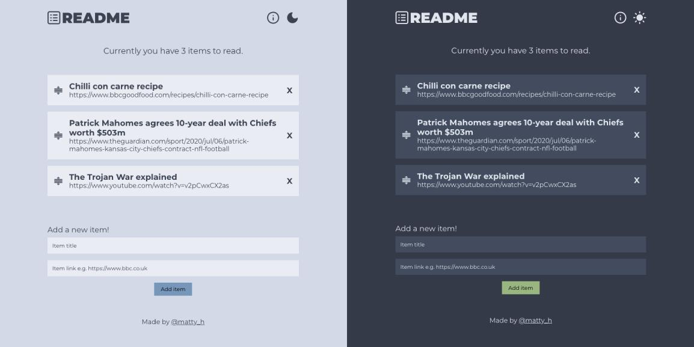

# Readme App

Readme is a simple app that holds the pages that you haven't read yet, but you would like to at some point in the future in your browser's localStorage. It's built with React.js, TypeScript and styled components.

[View Readme App](https://readme-app.netlify.app/)



## Getting Started

```bash
$ git clone https://github.com/matt-harris/react-ts-myreadinglist

$ cd react-ts-myreadinglist

$ npm install

$ npm start
```

> Open [http://localhost:3000](http://localhost:3000) to see the app running in dev mode.

## Deployment Status

[](https://app.netlify.com/sites/readme-app/deploys)

## Author

- **Matt Harris** - [matt-harris](https://github.com/matt-harris)
